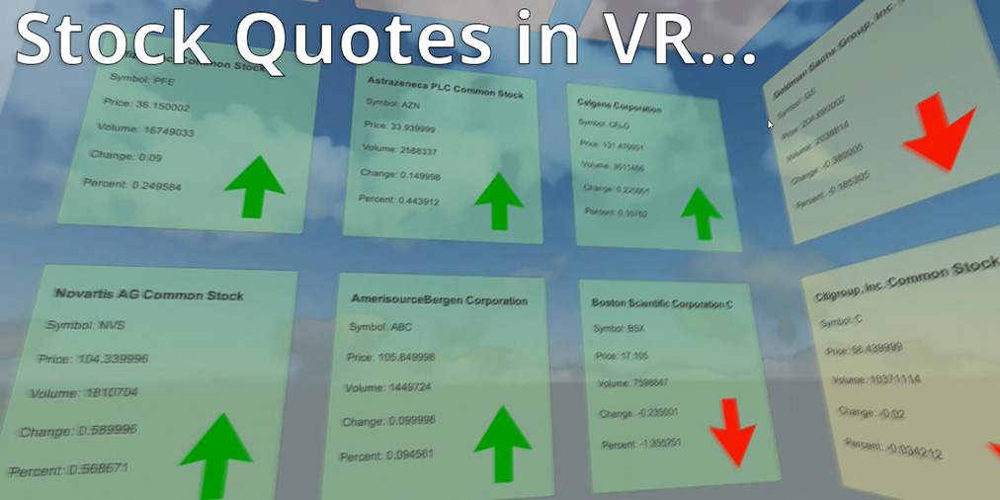

# Stock Cube

A quick Unity 'sketch', bringing stock quotes into virtual reality.

The demo was created in Unity3d (Version 5.2.2.f1), running on a Windows 10 PC, with Oculus PC Runtime V.0.8.0.0-beta installed.
The app was built and tested on both Oculus Rift and Samsung Gear VR. 

The demo's script logic all stems from this file:  
Assets/Scripts/StockCubeController.cs

(StockCubeController.cs is attached to the 'Controller' GameObject in the Scene Hierarchy)

The code is simple and should be straightforward to follow.
I will provide some more detailed documentation when I get the time!

Milan
